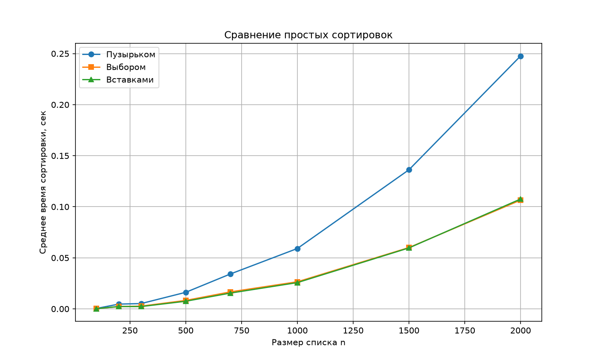

# Лабораторная работа: Простые алгоритмы сортировки

## Цель
Изучить простые алгоритмы сортировки и сравнить их по скорости.

## Файлы проекта
- `sorts.py` — три сортировки: пузырьком, выбором, вставками.
- `demo.py` — проверка на маленьком списке.
- `experiments.py` — сравнение скорости и график.
- `sorting_comparison.png` — график зависимости времени от n.

## Реализованные алгоритмы

### Сортировка пузырьком
Сравнивает соседние элементы и меняет их местами, если они в неправильном порядке.
- Время: O(n²) в среднем и худшем, O(n) в лучшем.
- Память: O(1).

### Сортировка выбором
На каждом шаге ищет минимум в оставшейся части и ставит его в начало.
- Время: всегда O(n²).
- Память: O(1).

### Сортировка вставками
Берёт по одному элементу и вставляет в нужное место в уже отсортированной части.
- Время: O(n²) в среднем и худшем, O(n) в лучшем.
- Память: O(1).

## Результаты замеров

| n | Пузырьком, с | Выбором, с | Вставками, с |
|---|---|---|---|
| 100 | ... | ... | ... |
| 200 | ... | ... | ... |
| ... | ... | ... | ... |

## Вывод
Все три сортировки квадратичные: с ростом n время растёт примерно как n².
Пузырёк и выбор работают похоже, вставки в среднем быстрее на случайных данных.
Для больших массивов нужны более быстрые алгоритмы (быстрая сортировка, слиянием, Timsort).